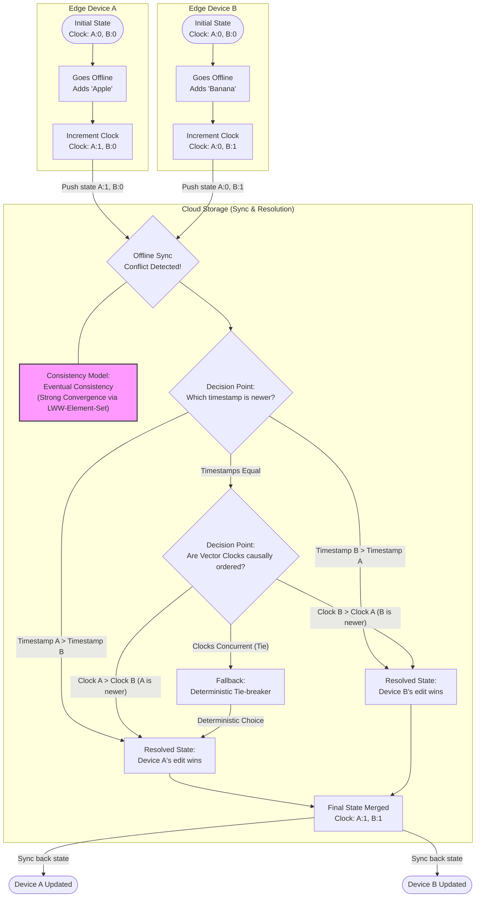

# GhostNode Design & Architecture

This document outlines the core architecture, consistency guarantees, and memory optimization strategies implemented in **GhostNode**.

---

## Architectural Diagram

The diagram below maps the synchronization flow between Edge Devices and Cloud Storage. It illustrates how the system manages state transitions, utilizes Vector Clocks to trace the causal history, and resolves conflicting edits.



> [!IMPORTANT]
> **Offline-First Resilience**
> This diagram illustrates how GhostNode ensures that even if a POS terminal is disconnected for the duration of a dinner rush, it will converge to the global truth without human intervention upon reconnection.

---

## Technical Specifications

### 1. Consistency Model: Strong Eventual Consistency (SEC)

GhostNode implements the **LWW-Element-Set** (Last-Writer-Wins) CRDT to achieve **Strong Eventual Consistency (SEC)**. 

Unlike traditional eventual consistency (where replicas can temporarily diverge and require manual conflict resolution or custom rules), SEC guarantees that any two replicas that have received the same set of updates will converge to the **exact same state automatically**. This process does not require expensive consensus coordination protocols (like Paxos or Raft).

This convergence is guaranteed by design because the merge operation (`LWWElementSet.merge`) behaves as a mathematical semi-lattice. In simple terms, merging state satisfies three key algebraic properties:

1. **Commutativity** (Order doesn't matter): 
   * `Merge(State A, State B) == Merge(State B, State A)`
   * Replicas can receive updates in different orders and still end up with the same final state.
   
2. **Associativity** (Grouping doesn't matter): 
   * `Merge(Merge(State A, State B), State C) == Merge(State A, Merge(State B, State C))`
   * The grouping of state merges across network segments has no impact on the final outcome.
   
3. **Idempotency** (Duplicates don't matter): 
   * `Merge(State A, State A) == State A`
   * Receiving the same update multiple times (e.g., due to network retries) does not alter the state.

---

### 2. JVM Memory Optimization: Structural Sharing

Because distributed systems generate a high volume of mutation states, naive copy-on-write strategies would put severe pressure on the JVM garbage collector (GC) by allocating full copies of sets for every addition or removal.

GhostNode mitigates this using `kotlinx-collections-immutable`'s **`PersistentMap`** under the hood:
*   **Path Copying (Trie-based)**: When an element is added to `addSet` or `removeSet`, only the affected path of the underlying Radix Trie is copied. The rest of the tree is shared by reference with the previous version.
*   **Zero Full Duplication**: Merges and updates do not require duplicating the entire data set, avoiding massive object allocations. This optimization is critical for memory-constrained platforms, such as Android edge terminals or high-throughput JVM backend nodes.

---

### 3. Verification & Simulation Suite

To ensure GhostNode is production-ready for high-scale, distributed environments, we have implemented a rigorous simulation suite ([GhostNodeSimulator.kt](file:///Users/mathan/Projects/GhostNode/ghostnode-core/src/test/kotlin/com/ghostnode/core/crdt/GhostNodeSimulator.kt)).

#### Key Verification Metrics:
- **Idempotency & Commutativity**: Verified via randomized, sequence-independent merge operations.
- **Property-Based Fuzz Testing**: Executed 2,000+ random mutations across a 5-node cluster to ensure global state convergence regardless of network jitter, partitioning, or out-of-order packet delivery.
- **Deterministic Convergence**: The simulation suite uses a seeded random generator, ensuring that the resolution logic is fully reproducible and verifiable.

To run the verification suite and inspect the simulation logs:
```bash
./gradlew test --info --tests com.ghostnode.core.crdt.GhostNodeSimulator
```
